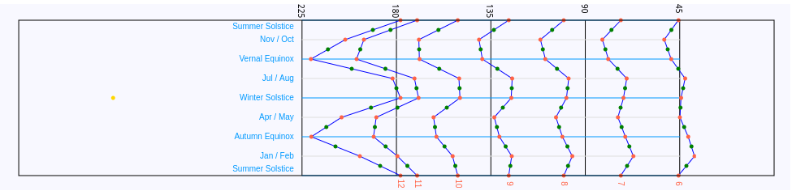

# Aquitaine Sundial Ring - Shepperd's Sundial - Calculator

This is a JavaScript calculator for an Aquitaine Sundial Ring. The principle is the same as in Shepperd's sundial, but
I believe the difference is the Aquitaine Sundial projects light over the interior of a ring, while the Shepperd's Sundial 
projects a shadow over the exterior of a cylinder.

Be it as it may, I wanted to share some resources for building this ring sundial.



## Running it

1.  **Install Dependencies:**
    ```bash
    npm install
    ```

2.  **Start Development Server:**
    ```bash
    npm run start
    ```
    
This command should start a dev server http://localhost:9966/

### Customization

The sundial's calculations can be localized by modifying constants within `main.js`. Specifically, adjust the following:

*   `LATITUDE`: Observer's geographical latitude.
*   `LONGITUDE`: Observer's geographical longitude.
*   `TIME_ORIGIN`: Reference date for day counting.


## The files

`lib/declination.js` contains the fundamental astronomical calculations needed 

`lib/sundial.js` utilizes the astronomical data from `declination.js` to generate the geometric data points necessary 
for drawing the sundial components.
